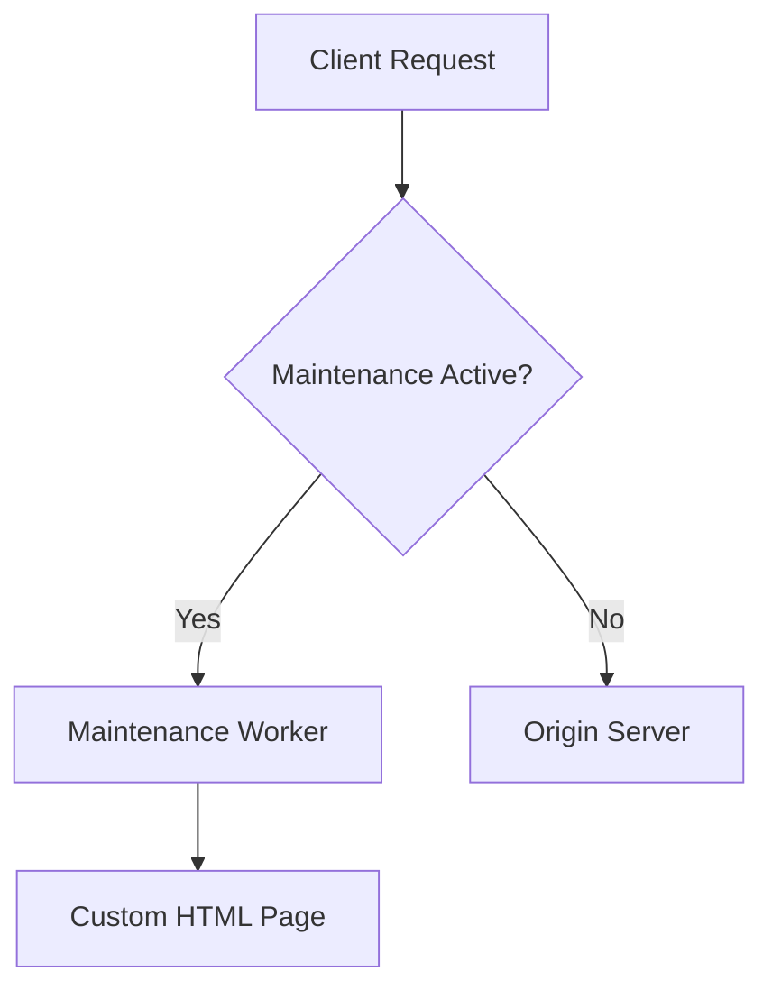

# Terraform Cloudflare Maintenance

[](LICENSE)
[](https://github.com/RichardLitt/standard-readme)
[](versions/tf)
[](versions.tf)

Enterprise-grade maintenance mode solution for Cloudflare infrastructure with Terraform.

## Table of Contents

-   [Security](#security)
-   [Background](#background)
-   [Install](#install)
-   [Usage](#usage)
-   [API](#api)
-   [Contributing](#contributing)
-   [License](#license)

## Security

### Compliance
-   **GDPR**: All access logs are anonymized through Cloudflare's privacy features
-   **SOC2**: Changes enforced through Terraform Cloud audit trails
-   **Secret Management**: API tokens stored in Terraform Cloud's secure variables

### Access Controls
```hcl
provider "cloudflare" {
  api_token = var.cloudflare_api_token # Stored as sensitive variable
  account_id = var.account_id
}
```

## Background

Modern web applications require zero-downtime maintenance operations. This Terraform module provides:

-   🛡️ Maintenance page worker script with customizable HTML/CSS
-   🌍 Geo-based traffic routing
-   🔄 Seamless integration with Cloudflare's CDN
-   📊 Built-in logging and monitoring



## Install

1. Install Terraform ≥1.5.0
2. Configure Cloudflare credentials:

```bash
export CLOUDFLARE_API_TOKEN="your-api-token"
export CLOUDFLARE_ACCOUNT_ID="your-account-id"
```

3. Add module to your Terraform configuration:

```hcl
module "maintenance" {
  source  = "thomasvincent/terraform-cloudflare-maintenance/cloudflare"
  version = "1.0.0"
}
```

## Usage

```hcl
module "maintenance" {
  source = "./modules/maintenance-page"
  
  enabled           = true
  maintenance_title = "System Upgrade in Progress"
  contact_email     = "support@example.com"
  allowed_ips       = ["192.168.1.1"]
}
```

## API

### Input Variables
```hcl
variable "enabled" {
  description = "Toggle maintenance mode"
  type        = bool
  default     = false
}

variable "allowed_ips" {
  description = "IPs with normal access"
  type        = list(string)
  default     = []
}
```

### Outputs
```hcl
output "worker_url" {
  value = cloudflare_worker_script.maintenance.id
}

output "dns_status" {
  value = cloudflare_record.maintenance.status
}
```

## Contributing

See [CONTRIBUTING.md](CONTRIBUTING.md) for guidelines. PRs welcome!

1. Fork repository
2. Create feature branch (`git checkout -b feat/amazing-feature`)
3. Commit changes using emoji Conventional Commits
4. Push to branch (`git push origin feat/amazing-feature`)
5. Open Pull Request

## License

[MIT © Thomas Vincent](LICENSE)
