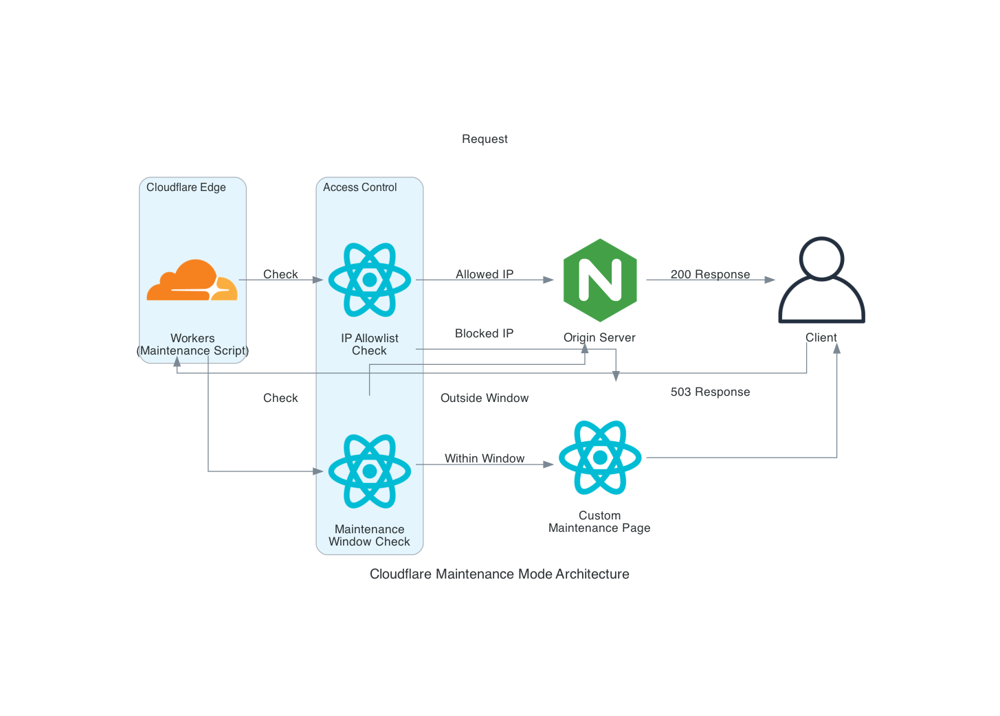
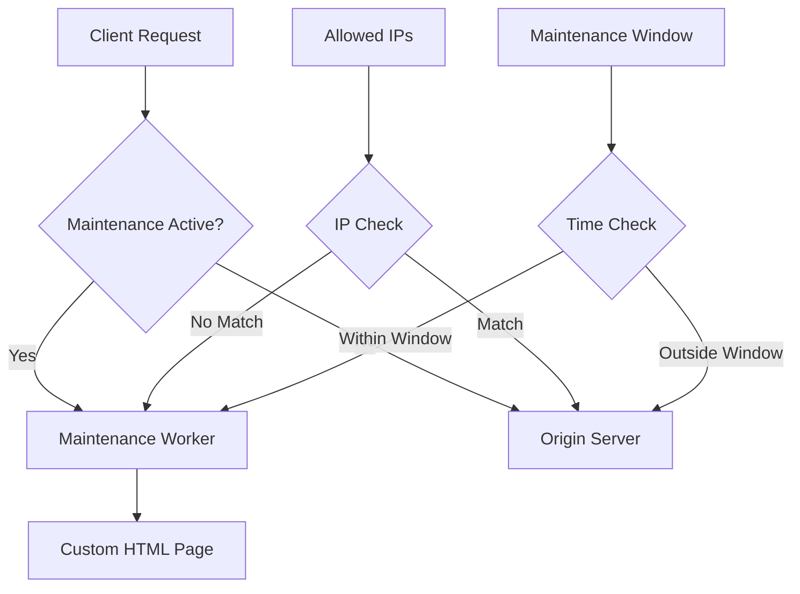

# Terraform Cloudflare Maintenance

[](LICENSE)
[](https://github.com/RichardLitt/standard-readme)
[](versions.tf)
[](versions.tf)
[](tests/)

Enterprise-grade maintenance mode solution for Cloudflare infrastructure with OpenTofu.

> **Note**: This module has been migrated from Terraform to [OpenTofu](https://opentofu.org/), the open-source fork of Terraform. OpenTofu is a drop-in replacement and is fully compatible with existing Terraform configurations.

## Table of Contents

- [Overview](#overview)
- [Features](#features)
- [Security](#security)
- [Requirements](#requirements)
- [Installation](#installation)
- [Usage](#usage)
  - [Basic Usage](#basic-usage)
  - [Advanced Configuration](#advanced-configuration)
- [Architecture](#architecture)
- [Input Variables](#input-variables)
- [Outputs](#outputs)
- [Testing](#testing)
- [Contributing](#contributing)
- [License](#license)

## Overview

This Terraform module provides a robust, enterprise-ready maintenance mode solution for Cloudflare-hosted applications. It deploys a customizable maintenance page using Cloudflare Workers, with features like IP allowlisting, scheduled maintenance windows, and detailed analytics.

## Features

- 🛡️ **Customizable Maintenance Page**: Fully customizable HTML/CSS with support for logos and branding
- 🔒 **IP Allowlisting**: Allow specific IPs to bypass maintenance mode (e.g., for testing or monitoring)
- ⏱️ **Scheduled Maintenance Windows**: Set specific time windows for maintenance mode to be active with RFC3339 timestamps
- 📅 **Cron-based Scheduling**: Configure recurring maintenance windows with cron expressions
- 📊 **Analytics Integration**: Built-in logging and monitoring with Cloudflare Analytics Engine
- 🌍 **Geo-based Routing**: Optional geo-based traffic routing for region-specific maintenance
- 🔄 **Zero-Downtime Toggle**: Enable/disable maintenance mode without redeployment
- 🔍 **SEO Friendly**: Proper HTTP status codes and headers for search engines
- 🔔 **Notification Support**: Slack, PagerDuty, and webhook integrations for maintenance alerts
- 🏷️ **Environment-Aware**: Support for multiple environments (production, staging, development)

## Security

### Compliance Features

- **GDPR Compliance**: All access logs are anonymized through Cloudflare's privacy features
- **SOC2 Compatibility**: Changes enforced through Terraform Cloud audit trails
- **Secret Management**: API tokens stored as sensitive variables

### Access Controls

```hcl
provider "cloudflare" {
  api_token = var.cloudflare_api_token # Stored as sensitive variable
  account_id = var.cloudflare_account_id
}
```

## Prerequisites

- OpenTofu >= 1.6.0 (or Terraform >= 1.5.0)
- Cloudflare Provider >= 5.2
- Cloudflare Account with Workers enabled
- Valid Cloudflare API credentials
- Cloudflare API Token with appropriate permissions:
  - Account.Workers Scripts:Edit
  - Zone.Workers Routes:Edit
  - Zone.DNS:Edit (if using custom DNS records)
  - Zone.Firewall Services:Edit (if using IP allowlisting)

## Quick Start

Initialize and apply:

```bash
terraform init
terraform plan
terraform apply
```

## Module Structure

- `main.tf` - Primary Cloudflare Worker and route definitions
- `variables.tf` - Input variable declarations with validation
- `outputs.tf` - Output value definitions
- `versions.tf` - Provider version constraints
- `modules/notifications/` - Notification integration submodule
- `examples/` - Usage examples (basic, advanced, scheduled)
- `tests/` - Integration tests


## Usage

### Basic Usage

```hcl
module "maintenance" {
  source = "github.com/thomasvincent/terraform-cloudflare-maintenance"
  
  cloudflare_api_token = var.cloudflare_api_token
  cloudflare_account_id = var.cloudflare_account_id
  cloudflare_zone_id = var.cloudflare_zone_id
  
  enabled = true
  maintenance_title = "System Upgrade in Progress"
  contact_email = "support@example.com"
  worker_route = "*.example.com/*"
  
  allowed_ips = [
    "192.168.1.1",
    "10.0.0.1"
  ]
}
```

### Advanced Configuration

For more advanced usage with scheduled maintenance windows, custom styling, and monitoring integration, see the [advanced example](examples/advanced-config/).

```hcl
module "maintenance" {
  source = "github.com/thomasvincent/terraform-cloudflare-maintenance"
  
  cloudflare_api_token = var.cloudflare_api_token
  cloudflare_account_id = var.cloudflare_account_id
  cloudflare_zone_id = var.cloudflare_zone_id
  
  # Environment configuration
  environment = "production"
  
  # Enable maintenance mode only for specific paths
  worker_route = "example.com/api/*"
  
  # Toggle maintenance mode based on environment
  enabled = var.environment == "production" ? false : true
  
  # Custom maintenance page content
  maintenance_title = "Scheduled System Maintenance"
  contact_email = "support@example.com"
  
  # Allow internal IPs to bypass maintenance
  allowed_ips = var.office_ip_ranges
  
  # Allow specific regions to bypass maintenance
  allowed_regions = ["US", "CA"]
  
  # Schedule maintenance window
  maintenance_window = {
    start_time = "2025-04-06T08:00:00Z"
    end_time = "2025-04-06T10:00:00Z"
  }
  
  # Custom styling
  custom_css = file("${path.module}/custom-styles.css")
  logo_url = "https://example.com/logo.png"
  
  # Cron-based scheduling (for documentation/future automation)
  schedules = [
    {
      name     = "weekly-maintenance"
      cron     = "0 2 * * SUN"  # Every Sunday at 2 AM
      duration = "2h"
      timezone = "America/Los_Angeles"
      notify   = ["slack://webhook", "pagerduty://service"]
    }
  ]
}
```

### Scheduled Maintenance with Notifications

See the [scheduled maintenance example](examples/scheduled-maintenance/) for a complete example with notification support.

```hcl
module "maintenance" {
  source = "github.com/thomasvincent/terraform-cloudflare-maintenance"
  
  cloudflare_api_token  = var.cloudflare_api_token
  cloudflare_account_id = var.cloudflare_account_id
  cloudflare_zone_id    = var.cloudflare_zone_id
  
  environment = "production"
  enabled     = true
  
  # Time-based maintenance window
  maintenance_window = {
    start_time = "2025-04-06T08:00:00Z"
    end_time   = "2025-04-06T10:00:00Z"
  }
  
  # Custom branding
  custom_css = "body { background: linear-gradient(135deg, #667eea 0%, #764ba2 100%); }"
  logo_url   = "https://example.com/logo.png"
  
  # Cron schedules for recurring maintenance
  schedules = [
    {
      name     = "weekly-maintenance"
      cron     = "0 2 * * SUN"
      duration = "2h"
      timezone = "America/Los_Angeles"
      notify   = ["slack://T00000000/B00000000/XXXXXXXXXXXXXXXXXXXX"]
    }
  ]
}

# Optional: Configure notifications
module "maintenance_notifications" {
  source = "github.com/thomasvincent/terraform-cloudflare-maintenance//modules/notifications"
  
  notification_urls = [
    "slack://T00000000/B00000000/XXXXXXXXXXXXXXXXXXXX",
    "pagerduty://your-routing-key"
  ]
  
  maintenance_status = module.maintenance.maintenance_status
  schedule_name      = "scheduled-maintenance"
  environment        = "production"
  
  maintenance_window = {
    start_time = "2025-04-06T08:00:00Z"
    end_time   = "2025-04-06T10:00:00Z"
  }
}
```

## Architecture

The module deploys the following components:





## Input Variables

| Name | Description | Type | Default | Required |
|------|-------------|------|---------|:--------:|
| cloudflare_api_token | Cloudflare API token with least privileges | `string` | n/a | yes |
| cloudflare_account_id | Cloudflare account ID | `string` | n/a | yes |
| cloudflare_zone_id | Cloudflare zone ID for the domain | `string` | n/a | yes |
| worker_route | URL pattern to trigger the maintenance worker | `string` | `"*.example.com/*"` | no |
| enabled | Toggle maintenance mode on/off | `bool` | `false` | no |
| environment | Environment name (e.g., production, staging) | `string` | `"production"` | no |
| maintenance_title | Title for the maintenance page | `string` | `"System Maintenance in Progress"` | no |
| maintenance_message | Message to display on the maintenance page | `string` | `"We are currently performing..."` | no |
| contact_email | Contact email to display on the maintenance page | `string` | `""` | no |
| allowed_ips | List of IP addresses that can bypass the maintenance page | `list(string)` | `[]` | no |
| allowed_regions | List of ISO 3166-1 alpha-2 country codes that can bypass maintenance | `list(string)` | `[]` | no |
| maintenance_window | Scheduled maintenance window in RFC3339 format | `object({start_time=string, end_time=string})` | `null` | no |
| schedules | List of cron-based scheduled maintenance windows | `list(object)` | `[]` | no |
| custom_css | Custom CSS for the maintenance page | `string` | `""` | no |
| logo_url | URL to the logo to display on the maintenance page | `string` | `""` | no |

For a complete list of variables, see [variables.tf](variables.tf).

## Outputs

| Name | Description |
|------|-------------|
| worker_id | The ID of the deployed worker script |
| worker_name | The name of the deployed worker script |
| worker_script_name | The name of the deployed worker script (alias) |
| worker_route_pattern | Cloudflare route pattern for the maintenance page |
| maintenance_status | Current status of the maintenance mode (ENABLED/DISABLED) |
| maintenance_enabled | Whether maintenance mode is currently enabled |
| maintenance_page_url | URL to access the maintenance page directly |
| environment | Environment name |
| maintenance_window | Scheduled maintenance window if configured |
| dns_record_id | ID of the DNS record for the maintenance status page |
| ruleset_id | ID of the firewall ruleset for IP/region allowlisting |
| allowed_regions | List of allowed regions that can bypass maintenance |

For a complete list of outputs, see [outputs.tf](outputs.tf).

## Cron Expression Reference

The `schedules` variable supports standard cron expressions:

```
 ┌───────────── minute (0 - 59)
 │ ┌───────────── hour (0 - 23)
 │ │ ┌───────────── day of month (1 - 31)
 │ │ │ ┌───────────── month (1 - 12)
 │ │ │ │ ┌───────────── day of week (0 - 6) (Sunday to Saturday)
 │ │ │ │ │
 * * * * *
```

Common examples:
- `0 2 * * SUN` - Every Sunday at 2 AM
- `0 3 1 * *` - First day of every month at 3 AM
- `0 0 * * 0,6` - Every Saturday and Sunday at midnight
- `30 4 * * 1-5` - Weekdays at 4:30 AM

## Notification Integrations

The module supports multiple notification channels through the `modules/notifications` submodule:

### Slack
Send notifications to Slack channels via incoming webhooks:
```hcl
notification_urls = ["slack://T00000000/B00000000/XXXXXXXXXXXXXXXXXXXX"]
```

### PagerDuty
Create incidents or events in PagerDuty:
```hcl
notification_urls = ["pagerduty://your-routing-key"]
```

### Generic Webhooks
Send JSON payloads to any webhook endpoint:
```hcl
notification_urls = ["webhook://https://example.com/webhook"]
```

See the [notifications module documentation](modules/notifications/README.md) for more details.

## Development

Format code:
```bash
terraform fmt -recursive
```

Validate configuration:
```bash
terraform validate
```

Run linting:
```bash
tflint
```

## Testing

This module includes comprehensive tests to ensure functionality and prevent regressions:

- **Unit Tests**: Test individual components of the worker script
- **Integration Tests**: Verify the entire module works as expected

To run the tests:

```bash
# Run unit tests for the worker
cd worker && npm test

# Run integration tests for the Terraform module
cd tests/integration && go test -v
```

## Contributing

Contributions are welcome! See [CONTRIBUTING.md](CONTRIBUTING.md) for guidelines.

1. Fork the repository
2. Create a feature branch (`git checkout -b feat/amazing-feature`)
3. Commit changes using Conventional Commits with emojis
4. Push to the branch (`git push origin feat/amazing-feature`)
5. Open a Pull Request

## License

[MIT © Thomas Vincent](LICENSE)
