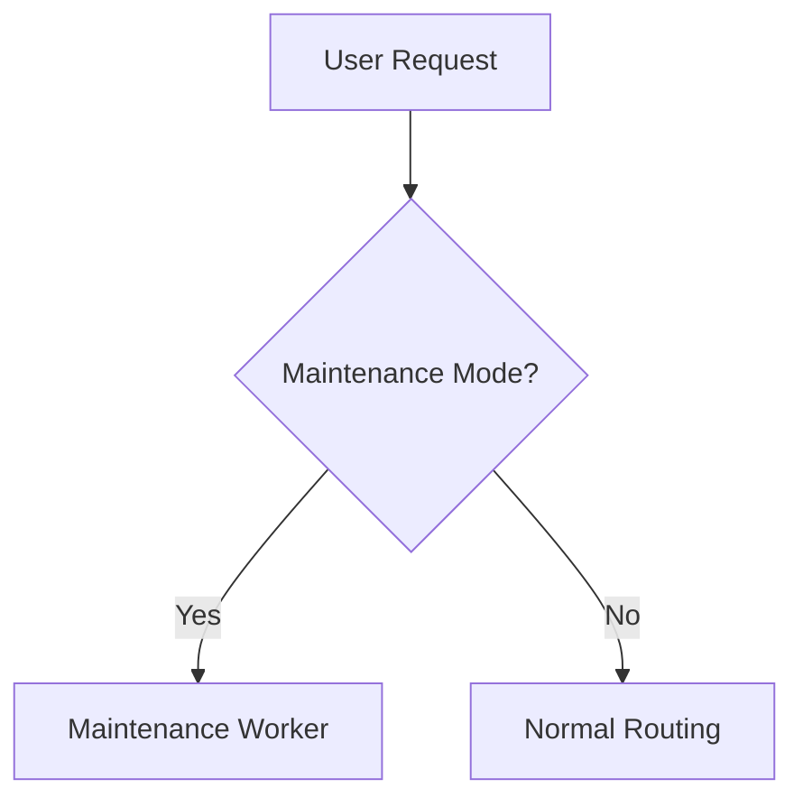

# terraform-cloudflare-maintenance

A fully featured Terraform + Cloudflare Workers project with advanced GitHub Flow, security, and CI/CD.

## Features

- **Terraform**-based infrastructure for Cloudflare Workers
- **Modern, minimal maintenance page** with performance, accessibility, and security
- **GitHub Flow** with branch protection, PR approvals, and advanced security scanning
- **Dependabot** updates for npm & Terraform
- **CodeQL** scanning for vulnerabilities
- **Comprehensive CI/CD** (Terraform validation, Worker tests, coverage placeholders)

## Quick Start

1. `terraform init`
2. `terraform apply`
3. Visit your domain to see the maintenance page.

## License

See [LICENSE](LICENSE).
## Architecture Diagram

## Compliance Requirements
-  GDPR: All logs anonymized
-  SOC2: Change management via Terraform Cloud

## Architecture Diagram

## Compliance Requirements
-  GDPR: All logs anonymized
-  SOC2: Change management via Terraform Cloud
