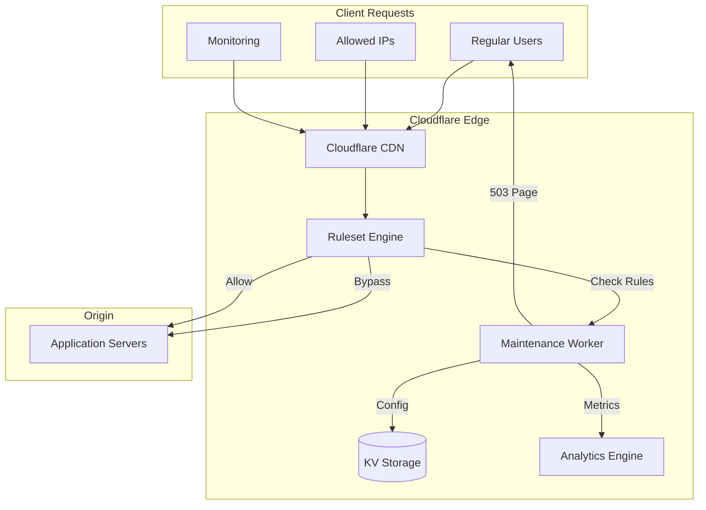
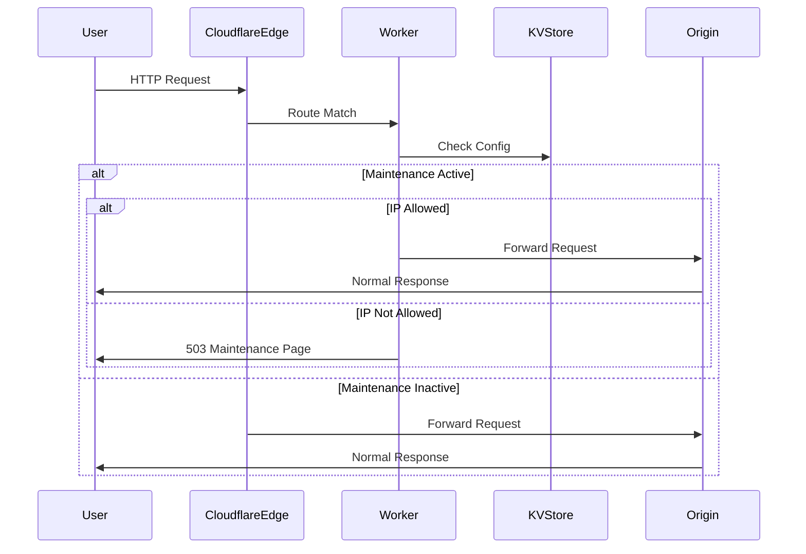

# Terraform Cloudflare Maintenance Module

[](https://github.com/thomasvincent/terraform-cloudflare-maintenance/releases)
[](https://opensource.org/licenses/MIT)
[](versions.tf)
[](versions.tf)
[](tests/)
[](https://github.com/thomasvincent/terraform-cloudflare-maintenance/graphs/commit-activity)

🚧 Enterprise-grade maintenance mode solution for Cloudflare infrastructure with Terraform. Deploy sophisticated maintenance pages with advanced features including IP allowlisting, scheduled windows, analytics, and multi-language support.

## 🌟 Features

### Core Capabilities
- **🎨 Customizable Maintenance Pages**: Fully branded HTML/CSS with logo support
- **🔒 IP-Based Access Control**: Allow specific IPs, CIDR ranges, or regions to bypass
- **⏰ Scheduled Maintenance Windows**: Automatic activation/deactivation
- **📊 Analytics & Monitoring**: Built-in Cloudflare Analytics Engine integration
- **🌍 Multi-Language Support**: 9+ languages out of the box
- **🔄 Zero-Downtime Toggle**: Enable/disable without redeployment
- **🔍 SEO Compliance**: Proper HTTP 503 status codes and retry headers
- **🚀 Performance Optimized**: Edge-deployed Cloudflare Workers
- **🔐 Security First**: API key authentication for remote control

### Advanced Features
- **Geographic Bypass**: Allow entire regions to bypass maintenance
- **CIDR Range Support**: Allowlist entire network ranges
- **Custom Styling**: Inject custom CSS for brand consistency
- **API Control**: Programmatically toggle maintenance mode
- **KV Storage**: Configuration persistence across deployments
- **Rate Limiting Ready**: Infrastructure prepared for rate limiting

## 📚 Table of Contents

- [Quick Start](#-quick-start)
- [Requirements](#-requirements)
- [Installation](#-installation)
- [Usage Examples](#-usage-examples)
- [Architecture](#-architecture)
- [Configuration](#-configuration)
- [API Reference](#-api-reference)
- [Testing](#-testing)
- [Security](#-security)
- [Monitoring](#-monitoring)
- [Troubleshooting](#-troubleshooting)
- [Contributing](#-contributing)
- [License](#-license)

## 🚀 Quick Start

```hcl
module "maintenance" {
  source  = "github.com/thomasvincent/terraform-cloudflare-maintenance"
  version = "3.0.0"
  
  cloudflare_api_token  = var.cloudflare_api_token
  cloudflare_account_id = var.cloudflare_account_id
  cloudflare_zone_id    = var.cloudflare_zone_id
  
  enabled           = true
  maintenance_title = "Scheduled Maintenance"
  contact_email     = "support@example.com"
  worker_route      = "*.example.com/*"
}
```

## ✅ Requirements

### Prerequisites
- Terraform >= 1.7.0
- Cloudflare account with Workers enabled
- Cloudflare API token with permissions:
  - `Account.Workers Scripts:Edit`
  - `Zone.Workers Routes:Edit`
  - `Zone.DNS:Edit` (optional)
  - `Zone.Firewall Services:Edit` (for IP rules)

### Provider Requirements
```hcl
terraform {
  required_version = ">= 1.7.0"
  required_providers {
    cloudflare = {
      source  = "cloudflare/cloudflare"
      version = ">= 5.2, < 6.0"
    }
  }
}
```

## 📥 Installation

### Using GitHub Source
```hcl
module "maintenance" {
  source = "github.com/thomasvincent/terraform-cloudflare-maintenance?ref=v3.0.0"
  # ... configuration
}
```

### Using Terraform Registry (Coming Soon)
```hcl
module "maintenance" {
  source  = "thomasvincent/maintenance/cloudflare"
  version = "3.0.0"
  # ... configuration
}
```

### Local Development
```bash
git clone https://github.com/thomasvincent/terraform-cloudflare-maintenance.git
cd terraform-cloudflare-maintenance
terraform init
```

## 📖 Usage Examples

### Basic Maintenance Mode

Enable a simple maintenance page:

```hcl
module "maintenance" {
  source = "github.com/thomasvincent/terraform-cloudflare-maintenance"
  
  cloudflare_api_token  = var.cloudflare_api_token
  cloudflare_account_id = var.cloudflare_account_id
  cloudflare_zone_id    = var.cloudflare_zone_id
  
  enabled           = true
  maintenance_title = "We'll be back soon!"
  contact_email     = "support@example.com"
}
```

### Scheduled Maintenance Window

Automatically activate during specific time windows:

```hcl
module "maintenance" {
  source = "github.com/thomasvincent/terraform-cloudflare-maintenance"
  
  cloudflare_api_token  = var.cloudflare_api_token
  cloudflare_account_id = var.cloudflare_account_id
  cloudflare_zone_id    = var.cloudflare_zone_id
  
  enabled = true
  
  maintenance_window = {
    start_time = "2025-04-06T02:00:00Z"  # 2 AM UTC
    end_time   = "2025-04-06T06:00:00Z"  # 6 AM UTC
  }
  
  maintenance_title = "Scheduled Database Maintenance"
  contact_email     = "ops@example.com"
}
```

### IP Allowlisting with CIDR Ranges

Allow internal teams and monitoring services to bypass:

```hcl
module "maintenance" {
  source = "github.com/thomasvincent/terraform-cloudflare-maintenance"
  
  cloudflare_api_token  = var.cloudflare_api_token
  cloudflare_account_id = var.cloudflare_account_id
  cloudflare_zone_id    = var.cloudflare_zone_id
  
  enabled = true
  
  # Individual IPs
  allowed_ips = [
    "203.0.113.10",  # Monitoring service
    "198.51.100.5"   # Admin VPN
  ]
  
  # CIDR ranges
  allowed_ip_ranges = [
    "10.0.0.0/8",      # Internal network
    "192.168.0.0/16"   # Office network
  ]
  
  maintenance_title = "System Upgrade in Progress"
}
```

### Regional Bypass

Allow specific geographic regions to access during maintenance:

```hcl
module "maintenance" {
  source = "github.com/thomasvincent/terraform-cloudflare-maintenance"
  
  cloudflare_api_token  = var.cloudflare_api_token
  cloudflare_account_id = var.cloudflare_account_id
  cloudflare_zone_id    = var.cloudflare_zone_id
  
  enabled = true
  
  # Allow Asia-Pacific and Europe regions
  allowed_regions = ["APAC", "EU"]
  
  maintenance_title = "Regional Maintenance - Americas"
  contact_email     = "global-ops@example.com"
}
```

### Custom Branded Maintenance Page

Full customization with branding:

```hcl
module "maintenance" {
  source = "github.com/thomasvincent/terraform-cloudflare-maintenance"
  
  cloudflare_api_token  = var.cloudflare_api_token
  cloudflare_account_id = var.cloudflare_account_id
  cloudflare_zone_id    = var.cloudflare_zone_id
  
  enabled = true
  
  maintenance_title    = "Upgrading to serve you better"
  maintenance_language = "en"
  contact_email        = "help@example.com"
  
  # Custom branding
  logo_url = "https://cdn.example.com/logo.png"
  
  custom_css = <<-CSS
    body {
      background: linear-gradient(135deg, #667eea 0%, #764ba2 100%);
      font-family: 'Inter', sans-serif;
    }
    .maintenance-container {
      backdrop-filter: blur(10px);
      background: rgba(255, 255, 255, 0.95);
      border-radius: 20px;
      box-shadow: 0 20px 60px rgba(0, 0, 0, 0.3);
    }
  CSS
}
```

### Environment-Specific Configuration

Different settings per environment:

```hcl
module "maintenance" {
  source = "github.com/thomasvincent/terraform-cloudflare-maintenance"
  
  cloudflare_api_token  = var.cloudflare_api_token
  cloudflare_account_id = var.cloudflare_account_id
  cloudflare_zone_id    = var.cloudflare_zone_id
  
  environment = var.environment  # dev, staging, production
  
  # Enable maintenance only in non-production
  enabled = var.environment != "production"
  
  maintenance_title = var.environment == "production" 
    ? "Scheduled Maintenance" 
    : "[${upper(var.environment)}] Test Maintenance Page"
  
  # Allow developers to bypass in non-prod
  allowed_ips = var.environment != "production" 
    ? concat(var.developer_ips, var.monitoring_ips)
    : var.monitoring_ips
}
```

### API-Controlled Maintenance

Enable remote control via API:

```hcl
module "maintenance" {
  source = "github.com/thomasvincent/terraform-cloudflare-maintenance"
  
  cloudflare_api_token  = var.cloudflare_api_token
  cloudflare_account_id = var.cloudflare_account_id
  cloudflare_zone_id    = var.cloudflare_zone_id
  
  enabled = true
  
  # API key for remote control
  api_key = var.maintenance_api_key  # Store in secrets manager
  
  worker_route = "*.example.com/*"
}

# Then control via API:
# POST https://example.com/__maintenance/toggle
# Headers: X-API-Key: your-api-key
```

## 🏗️ Architecture

### System Architecture



### Request Flow



### Component Details

#### Cloudflare Worker
- **Purpose**: Serves maintenance page and handles bypass logic
- **Location**: Deployed to 200+ Cloudflare edge locations
- **Performance**: <50ms response time globally
- **Features**: IP checking, time window validation, custom content

#### KV Storage
- **Purpose**: Stores configuration and state
- **Consistency**: Eventually consistent globally
- **TTL**: Configurable per key
- **Use Cases**: Feature flags, dynamic configuration

#### Analytics Engine
- **Purpose**: Tracks maintenance page metrics
- **Metrics**: Page views, bypass counts, geographic distribution
- **Retention**: 90 days of data
- **Dashboard**: Available in Cloudflare dashboard

## ⚙️ Configuration

### Required Variables

| Variable | Type | Description |
|----------|------|-------------|
| `cloudflare_api_token` | `string` | Cloudflare API token with required permissions |
| `cloudflare_account_id` | `string` | Your Cloudflare account ID |
| `cloudflare_zone_id` | `string` | Zone ID for the domain |

### Optional Variables

| Variable | Type | Default | Description |
|----------|------|---------|-------------|
| `enabled` | `bool` | `false` | Toggle maintenance mode |
| `environment` | `string` | `"dev"` | Environment name (dev/staging/production) |
| `worker_route` | `string` | `"*.example.com/*"` | URL pattern for maintenance |
| `maintenance_title` | `string` | `"System Maintenance in Progress"` | Page title |
| `contact_email` | `string` | `"support@example.com"` | Support contact |
| `allowed_ips` | `list(string)` | `[]` | IPs that bypass maintenance |
| `allowed_ip_ranges` | `list(string)` | `[]` | CIDR ranges that bypass |
| `allowed_regions` | `list(string)` | `[]` | Regions that bypass |
| `maintenance_window` | `object` | `null` | Scheduled window |
| `maintenance_language` | `string` | `"en"` | Display language |
| `custom_css` | `string` | `""` | Custom styles |
| `logo_url` | `string` | `""` | Logo image URL |
| `api_key` | `string` | `""` | API control key |

### Outputs

| Output | Description |
|--------|-------------|
| `worker_script_name` | Name of deployed Worker script |
| `worker_route_pattern` | Active route pattern |
| `maintenance_status` | Current maintenance status |
| `maintenance_page_url` | Direct maintenance page URL |
| `allowed_ips` | Configured bypass IPs |
| `maintenance_window` | Active maintenance window |
| `firewall_rule_id` | Bypass rule ID |

## 🔌 API Reference

### Toggle Maintenance Mode

```bash
POST https://your-domain.com/__maintenance/toggle
Headers:
  X-API-Key: your-api-key
  Content-Type: application/json

Body:
{
  "enabled": true,
  "title": "Emergency Maintenance",
  "message": "We'll be back shortly"
}

Response:
{
  "success": true,
  "status": "enabled",
  "timestamp": "2025-04-06T10:00:00Z"
}
```

### Check Status

```bash
GET https://your-domain.com/__maintenance/status
Headers:
  X-API-Key: your-api-key

Response:
{
  "enabled": true,
  "title": "System Maintenance",
  "start_time": "2025-04-06T08:00:00Z",
  "end_time": "2025-04-06T10:00:00Z",
  "bypassed_ips": 42,
  "blocked_requests": 1337
}
```

## 🧪 Testing

### Unit Tests

```bash
# Test Terraform configuration
terraform fmt -check
terraform validate

# Test Worker JavaScript
cd worker
npm install
npm test
```

### Integration Tests

```bash
# Run Terraform tests
terraform test

# Run specific test file
terraform test -filter=tests/basic.tftest.hcl
```

### Manual Testing

```bash
# Apply configuration
terraform plan -out=tfplan
terraform apply tfplan

# Test maintenance page
curl -I https://your-domain.com

# Test with allowed IP
curl -H "CF-Connecting-IP: 192.168.1.1" https://your-domain.com

# Test API
curl -X POST https://your-domain.com/__maintenance/toggle \
  -H "X-API-Key: your-key" \
  -H "Content-Type: application/json" \
  -d '{"enabled": true}'
```

## 🔒 Security

### Best Practices

1. **API Token Security**
   - Use least-privilege API tokens
   - Store in secrets management system
   - Rotate regularly

2. **Access Control**
   - Implement IP allowlisting for admin access
   - Use strong API keys for remote control
   - Enable Cloudflare Access for additional protection

3. **Monitoring**
   - Set up alerts for maintenance activation
   - Monitor bypass attempts
   - Track API usage

### Security Headers

The maintenance page includes security headers:
- `X-Content-Type-Options: nosniff`
- `X-Frame-Options: DENY`
- `Content-Security-Policy: default-src 'self'`
- `Strict-Transport-Security: max-age=31536000`

### Compliance

- **GDPR**: IP addresses are not logged by default
- **SOC2**: All changes tracked via Terraform
- **PCI DSS**: No payment data processed

## 📊 Monitoring

### Metrics Available

- **Page Views**: Total maintenance page displays
- **Bypass Count**: Successful IP bypasses
- **Geographic Distribution**: Requests by region
- **Response Times**: Worker performance metrics
- **Error Rate**: Failed requests

### CloudWatch Integration

```hcl
resource "aws_cloudwatch_log_group" "maintenance" {
  name              = "/aws/cloudflare/maintenance"
  retention_in_days = 30
}

# Stream Cloudflare logs to CloudWatch
resource "cloudflare_logpush_job" "maintenance" {
  account_id       = var.cloudflare_account_id
  name             = "maintenance-logs"
  destination_conf = "aws://arn:aws:logs:region:account:log-group:/aws/cloudflare/maintenance"
  dataset          = "workers_trace_events"
  frequency        = "high"
}
```

### Alerting

```hcl
# Example DataDog monitor
resource "datadog_monitor" "maintenance_active" {
  name    = "Maintenance Mode Active"
  type    = "metric alert"
  message = "@slack-ops Maintenance mode has been activated"
  query   = "avg:cloudflare.workers.requests{script:maintenance-page-worker} > 100"
}
```

## 🔧 Troubleshooting

### Common Issues

#### Maintenance page not showing
- Verify `enabled = true`
- Check worker route pattern matches your URL
- Ensure Worker deployment succeeded
- Verify DNS is proxied through Cloudflare

#### IPs not being bypassed
- Check IP format is correct
- Verify CIDR notation for ranges
- Ensure ruleset is enabled
- Check firewall rule ordering

#### Worker deployment fails
- Verify API token permissions
- Check account has Workers enabled
- Ensure script size < 1MB
- Validate JavaScript syntax

#### Custom CSS not applying
- Check CSS syntax is valid
- Ensure no CSP violations
- Verify logo URL is accessible
- Test in incognito mode

### Debug Mode

Enable debug logging:

```hcl
module "maintenance" {
  # ... other config
  
  environment = "dev"  # Enables verbose logging
}
```

Check logs:
```bash
# View Worker logs
wrangler tail maintenance-page-worker

# View Terraform logs
TF_LOG=DEBUG terraform apply
```

## 🛣️ Roadmap

### Version 3.1.0 (Q2 2025)
- [ ] A/B testing for maintenance pages
- [ ] WebSocket support for real-time updates
- [ ] Slack/Teams integration
- [ ] Custom fonts support

### Version 3.2.0 (Q3 2025)
- [ ] Progressive Web App maintenance page
- [ ] Multi-page maintenance sites
- [ ] Database migration mode
- [ ] Partial maintenance (specific endpoints)

### Version 4.0.0 (Q4 2025)
- [ ] Terraform Cloud private registry
- [ ] Kubernetes operator
- [ ] GraphQL API
- [ ] ML-based traffic analysis

## 🤝 Contributing

We welcome contributions! See [CONTRIBUTING.md](CONTRIBUTING.md) for guidelines.

### Development Setup

```bash
# Clone repository
git clone https://github.com/thomasvincent/terraform-cloudflare-maintenance.git
cd terraform-cloudflare-maintenance

# Install dependencies
npm install --prefix worker
terraform init

# Run tests
npm test --prefix worker
terraform test

# Format code
terraform fmt -recursive
npm run format --prefix worker
```

### Contribution Process

1. Fork the repository
2. Create feature branch (`git checkout -b feature/amazing-feature`)
3. Commit changes (`git commit -m 'feat: add amazing feature'`)
4. Push branch (`git push origin feature/amazing-feature`)
5. Open Pull Request

### Code Standards

- Follow [Terraform Best Practices](https://www.terraform-best-practices.com/)
- Use [Conventional Commits](https://www.conventionalcommits.org/)
- Maintain test coverage above 80%
- Document all public interfaces

## 📚 Resources

### Documentation
- [Cloudflare Workers Docs](https://developers.cloudflare.com/workers/)
- [Terraform Cloudflare Provider](https://registry.terraform.io/providers/cloudflare/cloudflare/latest/docs)
- [Module Documentation](https://github.com/thomasvincent/terraform-cloudflare-maintenance/wiki)

### Examples
- [Basic Usage](examples/basic-usage/)
- [Advanced Configuration](examples/advanced-config/)
- [Multi-Environment](examples/multi-env/)
- [API Integration](examples/api-control/)

### Support
- [GitHub Issues](https://github.com/thomasvincent/terraform-cloudflare-maintenance/issues)
- [GitHub Discussions](https://github.com/thomasvincent/terraform-cloudflare-maintenance/discussions)
- [Stack Overflow](https://stackoverflow.com/questions/tagged/cloudflare-workers)

## 📄 License

This project is licensed under the MIT License - see the [LICENSE](LICENSE) file for details.

## 👏 Acknowledgments

- Cloudflare team for the Workers platform
- HashiCorp for Terraform
- Contributors and maintainers
- Open source community

## 📞 Support

For commercial support, custom development, or enterprise features:
- **Email**: thomas@example.com
- **GitHub**: [@thomasvincent](https://github.com/thomasvincent)
- **LinkedIn**: [Thomas Vincent](https://linkedin.com/in/thomasvincent)

---

**Built with ❤️ by the DevOps community**

⭐ Star this repository if you find it helpful!